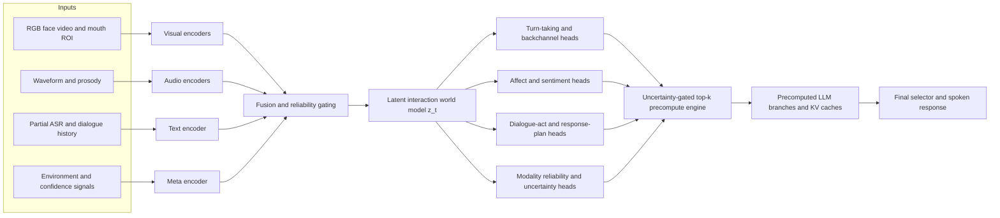
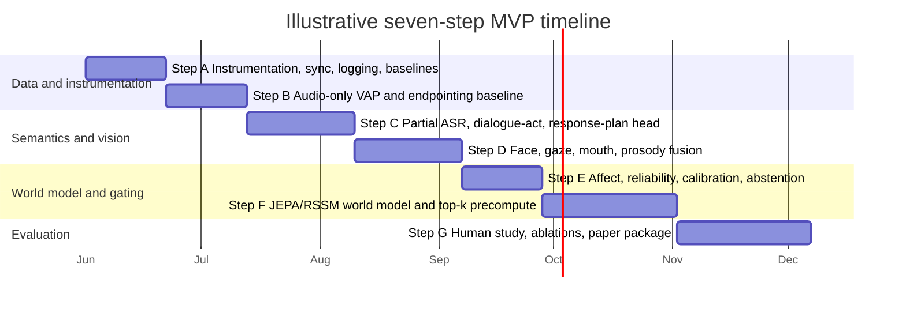

# Predictive Multimodal Interaction World Model for Low-Latency Assistants

## Executive summary

The strongest publishable version of this project is **not** “emotion recognition added to a voice assistant.” It is a **latent interaction world model** that continuously predicts near-future conversational state from multimodal evidence—especially the visual channel, which often reveals speech-relevant information before acoustics are fully available—and uses those predictions to **precompute candidate assistant responses** before the user has finished speaking. The system should only commit to a response when calibrated uncertainty is low; otherwise it should fall back to conventional post-turn generation. That framing ties together four literatures that are usually studied separately: audiovisual speech, turn-taking, incremental dialogue, and world models. citeturn15search8turn15search4turn20view1turn20view3turn20view7turn36view2turn20view5turn20view6

This project is timely because human conversation is extremely fast. Across languages, spoken responses tend to occur with minimal gap and often within a few hundred milliseconds, while language planning itself generally takes longer, implying that people anticipate upcoming turn completions and semantic content before the current speaker fully finishes. Existing spoken dialogue systems frequently remain too reactive, and recent work explicitly shows that large language models often know **what** to say but struggle with **when** to speak. citeturn25search0turn25search1turn26search1turn20view7turn14search3turn14search11

The core technical recommendation is a **hybrid JEPA-plus-RSSM architecture**. Use JEPA-style latent predictive pretraining to learn semantic, non-pixel multimodal representations from large amounts of unlabeled conversation video and audio, then place an RSSM-style online latent dynamics model on top for filtering, uncertainty, and action-conditioned prediction during live interaction. In other words: **JEPA for representation learning, RSSM for interaction-time state estimation and forecasting**. That is a much better fit for this problem than training a full generative video world model. citeturn20view5turn36view0turn36view1turn36view2turn38view1turn37view0

A publishable claim should therefore be framed as: **Can a predictive multimodal interaction world model reduce effective response latency at matched response quality and turn-taking naturalness, relative to strong audio-only and no-precompute baselines?** The contribution is not just faster onset. The contribution is a **latency-quality Pareto improvement** backed by calibrated gating, multimodal ablations, and human evaluation. citeturn20view2turn28view0turn20view8turn17search0turn17search2turn17search1

A good paper title would be something like **Visual Head Start, Latent Interaction World Models, and Uncertainty-Gated Precomputation for Low-Latency Spoken Assistants**. A good short thesis statement would be: **visual temporal advantage and multimodal interaction forecasting allow assistants to prepare response branches earlier, but only calibrated uncertainty gating prevents speed from degrading accuracy**. citeturn15search8turn20view2turn28view0turn17search0turn17search1

## Literature review and the research gap

Human turn-taking is fast enough that simple silence-threshold endpointing is fundamentally inadequate. Cross-linguistic work found a universal pressure toward minimal gap and minimal overlap between turns, and later reviews note that median conversational latencies are often under 300 ms. At the same time, experimental and theoretical work on language production indicates that composing an answer normally takes longer than the observed turn gaps, so speakers must begin planning while listening. De Ruiter and colleagues argued that robust turn-end projection depends strongly on contextual and lexical-syntactic information rather than only final prosody. citeturn25search0turn25search1turn26search1turn26search16turn20view7

That timing pressure is exactly where the visual channel matters. Visual information from a talker’s mouth can arrive before the corresponding acoustic signal for many utterances, and dynamic facial motion has been shown to speed auditory cortical processing. Other work shows that facial configuration contains recoverable information about the vocal tract state, which strengthens the case for using mouth and face dynamics as early predictive cues rather than as merely decorative side information. citeturn15search8turn15search4turn15search0

The turn-taking literature also now treats conversation as deeply multimodal. Skantze’s review synthesizes evidence for verbal, prosodic, breathing, gaze, and gestural cues in turn management. Kendrick, Holler, and Levinson argue that face-to-face turn-taking is multimodal and show that gaze direction and manual gestures help coordinate transitions. Recent predictive models confirm that this is not only linguistically interesting but computationally useful: MM-VAP adds facial expression, head pose, and gaze to audio and outperforms state-of-the-art audio-only turn-taking prediction, while newer work shows that visual cues materially improve robustness in noise. citeturn20view1turn19search2turn20view2turn28view0

There is already a line of work on **prediction-based latency reduction** in dialogue. Ekstedt and Skantze implemented “projection of turn completion” in an incremental spoken dialogue system by using a language model to generate likely futures and estimate completion points before ASR had finished. Later work combined incremental response generation with VAP-based turn-taking in real systems and evaluated user effects. In parallel, full-duplex dialogue work such as SyncLLM and listening-while-speaking speech language models has emphasized continuous listening, backchannels, overlap handling, low-latency chunk prediction, and resilience to network delay. citeturn20view7turn20view8turn40view0turn40view1

What is still missing is the **world-model view** of this problem. JEPA-style models predict future representations in latent space rather than raw observations, which is attractive because the assistant does not need to reconstruct every upcoming pixel or waveform detail; it needs to predict **interaction-relevant latent variables**. RSSM-style world models, introduced in PlaNet and refined in Dreamer, combine deterministic memory with stochastic latent state and are strong for online belief tracking under partial observability. LeCun’s position paper explicitly argues for predictive world models and hierarchical joint-embedding architectures, while I-JEPA, V-JEPA, and Meta’s V-JEPA 2 show that latent predictive modeling can learn semantics, motion understanding, anticipation, and even planning capabilities without full generative decoding. citeturn36view2turn20view5turn36view0turn36view1turn38view1turn37view0

The research gap is therefore precise: there is strong evidence for visual temporal advantage, strong evidence for multimodal turn-taking cues, growing evidence for incremental and full-duplex dialogue, and strong momentum behind latent predictive world models—but there is not yet a canonical system that **unifies those pieces into a predictive multimodal interaction world model whose explicit purpose is to reduce effective assistant response latency without sacrificing response quality**. That gap is large enough for a publishable paper, especially if the evaluation is designed around latency-quality tradeoffs rather than only turn-end classification accuracy. citeturn15search8turn20view2turn20view7turn20view8turn36view0turn37view0

### World model design choices

| Option | What it models best | Why it helps here | Weakness | Recommendation |
|---|---|---|---|---|
| **JEPA-style latent prediction** | Predicting future semantic representations without pixel/audio decoding. citeturn20view5turn36view0turn36view1 | Efficient self-supervised pretraining on large unlabeled conversation video; ideal for forecasting interaction-relevant latent states such as “yield/hold,” “backchannel soon,” or “intent trajectory.” | Weaker as a standalone online belief-tracker with explicit uncertainty under missing/noisy inputs. | Use for **modality encoder pretraining** and latent future prediction. |
| **RSSM-style latent dynamics** | Online filtering with deterministic memory plus stochastic state under partial observability. citeturn38view1turn37view0 | Well-suited to live conversational state tracking where cues are asynchronous, incomplete, and noisy. | Harder to pretrain at scale directly from raw multimodal streams than JEPA-style objectives. | Use for **online fused state \(z_t\)** and uncertainty-aware forecasting. |
| **Hybrid JEPA + RSSM** | Semantic representation learning plus online state estimation. citeturn20view5turn36view0turn38view1turn37view0 | Best balance for this project: low reconstruction cost, strong semantics, explicit dynamics, calibrated gating. | More engineering complexity. | **Best overall choice.** |

## Recommended modalities and sensing stack

The right modality set is not “everything measurable.” It is the subset that improves near-future inference **per unit of latency, privacy cost, and annotation burden**. The system should focus on signals that are available continuously, can be captured with deployable sensors, and have plausible causal relevance to turn-taking, intent forecasting, and response planning. citeturn20view1turn20view2turn28view0turn10search11turn10search7

### Recommended modalities and metasignals

| Stream | Example metasignals | Include in MVP | Rationale | Recommended extraction |
|---|---|---:|---|---|
| **Face and mouth video** | Lip aperture, mouth motion, viseme-like dynamics, eye gaze, head pose, eyebrow raise, blink, smile/action units | **Yes** | Visual speech often precedes acoustics; gaze, facial expression, and head pose improve turn-taking; visual cues help especially in noise. citeturn15search8turn15search4turn20view2turn28view0turn19search2 | Mouth ROI encoder with AV-HuBERT features; global face landmarks/AUs via OpenFace 2.0 or MediaPipe. citeturn18search0turn8search1turn8search0 |
| **Audio and prosody** | VAD, overlap, pause duration, final lengthening, F0, intensity/energy slope, speaking rate, laughter, breath-like events, creakiness/voice quality | **Yes** | VAP and prosody studies show strong value for upcoming shifts and backchannels; openSMILE is built exactly for such features. citeturn20view3turn19search3turn19search4turn8search2turn8search6 | wav2vec 2.0 or MMS embeddings plus openSMILE handcrafted prosody; pyannote for VAD/overlap/diarization. citeturn18search2turn18search3turn9search7turn9search13 |
| **Partial ASR and text** | Streaming transcript, discourse markers, repairs, filled pauses, dialogue-act cues, topic and slot hints, sentiment-bearing words | **Yes, but reliability-gated** | Incremental language cues help project completion and response timing, but noisy ASR can hurt turn-taking performance if trusted too much. citeturn20view7turn14search3turn28view0 | Whisper or other streaming ASR front-end for partial hypotheses; text encoder on partial tokens and confusion-aware lattices if available. citeturn8search3turn8search7 |
| **Temporal interaction history** | Turn durations, overlap history, backchannel density, interruption history, silence distribution, recent question-answer adjacency patterns | **Yes** | Human turn-taking is sequential and context-sensitive; conversation corpora such as CANDOR make these dynamics measurable. citeturn20view1turn24view0turn32view3 | Event-sequence encoder over interaction tokens; recurrent or transformer memory at 100–250 ms step size. |
| **Environment and quality signals** | SNR, noise class, reverberation, echo, lighting, face visibility, occlusion, camera confidence, distance/proximity | **Yes** | Noise and degraded conditions sharply affect predictive turn-taking; quality signals should modulate modality reliability and fallback behavior. citeturn28view0turn8search3 | Lightweight quality heads; ASR confidence; face tracker confidence; SNR/RT60 estimates. |
| **Model confidence and disagreement** | Entropy, calibrated probability, ensemble disagreement, conformal set size, missing-modality masks | **Yes** | This is the safety valve that lets you gain speed without losing accuracy. Calibration and uncertainty estimation are central to reliable gating. citeturn17search0turn17search2turn17search1 | Temperature scaling offline; deep ensembles or dropout online; conformal thresholds for abstention. |
| **Upper-body/manual gestures** | Hand gestures, self-touch, torso lean, nod amplitude | **Optional phase two** | Gesture and body cues help turn coordination, but camera framing is inconsistent and annotation is harder. citeturn19search2turn23view0 | Pose/body keypoints if framing allows. |
| **Depth or thermal** | Kinect depth maps, thermal face stream | **No for MVP** | Useful in lab corpora, but weak deployability and added privacy/collection burden. NoXi includes depth, but it should remain optional for a practical assistant. citeturn23view0 | Lab-only ablation if available. |
| **Physiological sensing** | GSR, heart rate, EEG | **No for MVP** | High friction, sensitive personal data, poor deployment realism, and substantial privacy concerns. citeturn10search11turn10search7 | Exclude from the publishable core system. |
| **Identity or demographic inference** | Age, gender, ethnicity, identity embeddings | **Explicitly exclude** | Not needed for latency reduction and increases bias/privacy risk. citeturn10search11turn10search7 | Do not build these features. |

A critical design choice is how emotion is represented. The literature strongly cautions against treating facial movements as direct, culture-invariant readouts of internal emotional state. For this project, use **interactional affect** primarily as a latent support signal—valence/arousal, frustration escalation, engagement, cooperativeness, or “need for empathy”—rather than as a high-stakes discrete claim such as “the user is angry.” Discrete labels from MELD and IEMOCAP are still useful for supervision, but the deployable system should prefer **continuous, uncertainty-aware affect estimates** and should never rely on emotion alone to trigger assistant behavior. citeturn10search0turn10search1turn10search16

### Capture methods, preprocessing, and recommended encoders

For a practical MVP, use a **front-facing RGB camera** and a **high-quality microphone**, ideally with separate assistant echo reference or stereo channels when available. A 30 fps camera is a reasonable baseline because the visual head start in speech is often on the order of tens to around a hundred milliseconds, so even 30 fps gives multiple pre-acoustic frames; 60 fps is worthwhile if mouth-timing precision is a central research variable. Audio should be normalized to **16 kHz** for compatibility with major speech toolchains such as pyannote and MMS, though higher-rate capture is fine prior to resampling. This recommendation is an engineering inference from the timing literature plus tool requirements. citeturn15search8turn9search3turn18search7

The preprocessing pipeline should be strictly time-synchronized. On video, run face detection/tracking, landmark extraction, head pose, gaze, and AU or blendshape estimation, then create two parallel visual streams: a **global face stream** for gaze/head/expression and a **mouth ROI stream** for speech-related motion. On audio, run denoising and echo control if needed, VAD/overlap/diarization, then extract both SSL embeddings and classic prosody. On text, consume **partial ASR hypotheses** and preserve timestamps. Finally, compute quality features such as face visibility, tracker confidence, SNR, and ASR confidence so the fusion layer knows when to distrust a modality. citeturn8search1turn8search0turn8search2turn9search7turn8search3

The most sensible encoder set is: **AV-HuBERT** for mouth-speech representation, **OpenFace 2.0** or **MediaPipe Face Landmarker** for controllable facial cues, **wav2vec 2.0** or **MMS** for speech embeddings, **openSMILE** for low-latency prosody, **pyannote.audio** for VAD/overlap/diarization, and a partial-ASR encoder based on **Whisper** or a streaming alternative. For generic scene or whole-face video pretraining, **V-JEPA** or **VideoMAE** are strong choices; V-JEPA is especially attractive if you want latent predictive pretraining aligned with your world-model story. citeturn18search0turn8search1turn8search0turn18search2turn18search3turn8search2turn9search7turn8search3turn36view0turn35search0

## Architecture and training strategy

The architecture should be **asynchronous, hierarchical, and branch-aware**. Audio evolves at a much finer timescale than text or facial gesture; the system should therefore process short frames continuously, aggregate them into interaction events, and maintain a latent state \(z_t\) that forecasts multiple future horizons, such as 200 ms, 500 ms, 1 s, and 2 s. The innovation is that the assistant does not wait for one monolithic “user finished” event. Instead it continually maintains a probability distribution over plausible near-future conversational continuations and response plans. citeturn20view3turn40view0turn36view0turn38view1

A useful formalization is:
\[
z_t = \mathcal{W}\big(z_{t-1}, e_t^v, e_t^a, e_t^w, e_t^q, u_{t-1}\big)
\]
where \(e_t^v,e_t^a,e_t^w,e_t^q\) are visual, audio, text, and quality embeddings and \(u_{t-1}\) is the previous assistant action. In the hybrid design, \(\mathcal{W}\) is an RSSM-style online state estimator whose encoders have been pretrained with JEPA-style objectives. That lets the model learn “what matters next” in latent space while still supporting online uncertainty estimates during deployment. This is a proposed synthesis rather than a previously standardized architecture, but it is directly motivated by the strengths of JEPA and RSSM-style world models. citeturn20view5turn36view0turn36view2turn38view1turn37view0

### Prediction heads

| Head | Output | Horizon | Loss | Why it matters |
|---|---|---|---|---|
| **Voice activity projection** | Future hold/shift/backchannel bins for both speakers | 0.2–2.0 s | Cross-entropy on VAP bins | Core turn-taking control. citeturn20view3 |
| **End-of-turn timing** | Time-to-yield or probability of floor release | 0.2–1.0 s | Huber / survival loss / CE over buckets | Needed for response onset scheduling. |
| **Dialogue act / intent** | Question, answer, elaboration, repair, acknowledgment, backchannel, clarification, etc. | 0.5–2.0 s | Cross-entropy | Converts low-level cues into response planning. citeturn29view0turn32view0 |
| **Partial ASR completion** | Likely continuation or completion embedding of the user utterance | 0.2–1.0 s | LM / CTC / embedding regression | Lets the system anticipate semantic closure. citeturn20view7turn40view0 |
| **Affect state** | Valence, arousal, sentiment polarity, frustration trend, engagement | 0.5–2.0 s | MSE / CCC / CE | Helps choose style, empathy, and backchanneling. citeturn20view11turn20view10turn22view3 |
| **Response-plan distribution** | Top-k assistant plan classes or latent response sketches | 0.5–2.0 s | Cross-entropy / ranking loss | Drives precomputation. |
| **Interruption risk** | Probability user will continue, repair, or barge in | 0.2–1.0 s | BCE | Prevents premature speaking. |
| **Reliability and uncertainty** | Calibration score, entropy, disagreement, conformal set size | Immediate | Brier / ECE post-hoc / ensemble loss | The gatekeeper for “speed without quality loss.” citeturn17search0turn17search2turn17search1 |

### Fusion, losses, and training recipe

Use **mid-level fusion** rather than early raw fusion. The model should first build modality-specific embeddings, then fuse them through cross-attention or a Perceiver-style module with explicit missing-modality masks and reliability weights. This matches current multimodal ERC and full-duplex work, where flexible fusion is important because the system will often be missing one stream or using degraded ASR in realistic settings. citeturn16search0turn16search1turn29view0turn40view1

The loss should be multi-task and multi-horizon:
\[
\mathcal{L}=\lambda_{\text{jepa}}\mathcal{L}_{\text{JEPA}}
+\lambda_{\text{rssm}}\mathcal{L}_{\text{dyn}}
+\lambda_{\text{vap}}\mathcal{L}_{\text{turn}}
+\lambda_{\text{eot}}\mathcal{L}_{\text{yield}}
+\lambda_{\text{da}}\mathcal{L}_{\text{dialog-act}}
+\lambda_{\text{aff}}\mathcal{L}_{\text{affect}}
+\lambda_{\text{resp}}\mathcal{L}_{\text{plan}}
+\lambda_{\text{cal}}\mathcal{L}_{\text{calibration}}
\]
where the JEPA term predicts future latent targets, the RSSM term models online dynamics and KL regularization, the turn term supervises VAP-style predictions, and the calibration term improves abstention and gating. For JEPA-style pretraining, latent regression with cosine or \(L_2\) loss plus collapse-avoidance regularization is appropriate; for RSSM, use the standard stochastic-plus-deterministic state objective and optionally latent overshooting. citeturn20view5turn36view0turn36view2turn38view1turn17search0

The most important **operational mechanism** is the precompute engine. At each step, a small policy head proposes top-k response plans—for example, *acknowledge and answer*, *clarify missing slot*, *empathetic acknowledgment plus answer*, *wait/backchannel only*. The main assistant model then precomputes limited continuations or KV caches for those branches. A branch is only committed if (a) turn-yield probability is high, (b) calibrated uncertainty is below threshold, and (c) the winning branch margin over alternatives is large enough. Otherwise the system keeps listening and may discard all caches. This is how the architecture avoids the classic failure mode of “being fast by being wrong.” The precompute engine is the key original contribution of the project. citeturn20view7turn20view8turn17search0turn17search1

### Tools, libraries, and compute

A realistic research stack is **PyTorch** for core modeling, **PyTorch Lightning** for distributed training scaffolding, **Hydra** for compositional configuration management, and **Weights & Biases** for experiment tracking and evaluation dashboards. For feature extraction and inference-time subsystems, use **OpenFace 2.0**, **MediaPipe**, **openSMILE**, **pyannote.audio**, **Whisper**, **AV-HuBERT**, and optionally **V-JEPA/VideoMAE** checkpoints. citeturn42search0turn42search1turn42search3turn42search2turn8search1turn8search0turn8search2turn9search7turn8search3turn18search0turn36view0turn35search0

For compute, the MVP should freeze the largest encoders and train only the fusion module, world model, and heads. That is feasible on **one to two 80 GB GPUs** or equivalent. A publishable large-scale version with joint fine-tuning and significant unlabeled multimodal pretraining will be more comfortable on **four to eight 80 GB GPUs**, especially if you pretrain a JEPA-style video branch. Online inference should separate the **fast world-model loop** from the **slower assistant generation loop**, ideally updating the latent state every 80–120 ms and keeping precomputed response branches on a separate process or GPU stream. Those are engineering recommendations rather than settled literature claims.

## Datasets, benchmarks, and implementation roadmap

No single dataset covers everything you need. The right strategy is **task-specialized pretraining plus joint fine-tuning**: affective corpora for sentiment and emotion, dialogue corpora for timing and turn-taking, and large natural conversation corpora for multimodal sequential pretraining. citeturn20view11turn20view10turn22view3turn32view0turn32view1turn23view0turn24view0turn29view0

### Recommended datasets and benchmarks

| Dataset | Modalities | Scale | Best use in this project | Main caveat |
|---|---|---|---|---|
| **CMU-MOSEI** | Language, vision, audio | 23,453 segments, 1,000 speakers, 250 topics. citeturn21view0 | Pretrain sentiment, valence/arousal, cross-modal fusion. | Not a turn-taking corpus; mostly opinion video clips. |
| **MELD** | Text, audio, video | 1,400+ dialogues, 13,000+ utterances from *Friends*. citeturn20view10turn11search3 | Emotion-in-conversation supervision and speaker-context modeling. | TV dialogue; domain shift to real conversation. |
| **IEMOCAP** | Audio, visual, motion capture, transcripts | ~12 hours, 10 actors, 5 dyadic sessions. citeturn22view0turn22view3 | Rich acted affect and multimodal alignment. | Acted and relatively small. |
| **Switchboard-1 / SWBD-DAMSL** | Audio, transcripts, dialog acts | ~260 hours, ~2,400 calls, 543 speakers; dialog acts on 1,155 conversations. citeturn33view2 | Audio turn-taking, dialog acts, incremental timing baselines. | Telephone speech only; limited visual channel; LDC access. |
| **HCRC Map Task** | Two-channel audio, transcripts, eye-contact manipulation | ~18 hours, 128 two-person conversations; eye-contact/no-eye-contact conditions. citeturn32view1turn32view2 | Turn structure and controlled pragmatic coordination. | Audio-focused; older collection style. |
| **NoXi** | Audio, video, depth, annotations | 25+ hours, 7 languages, dyadic novice-expert interactions, turn-taking and engagement descriptors. citeturn23view0turn20view13 | Multilingual audiovisual interaction pretraining, interruptions, engagement. | Request-based access; screen-mediated setting. |
| **CANDOR** | Video, audio, transcripts, facial/vocal/semantic measures | 1,656 conversations, 850 hours, >1 TB. citeturn24view0turn32view3 | Large-scale multimodal pretraining for natural conversation dynamics. | Access on request; Zoom-like setting. |
| **EgoCom** | Egocentric video, stereo audio, transcripts | 38.5 hours, 240k word-level transcriptions, 34 speakers. citeturn34search2 | Robust multimodal timing with embodied first-person context. | Multiparty, egocentric—not the simplest fit. |
| **MM-F2F** | Text, audio, video | 210+ hours, 1.5M words, ~20M frames. citeturn29view0 | Direct supervision for turn-taking and backchannel prediction with all three modalities. | Newer dataset; may require more preprocessing work. |
| **LRS3** | Audio-visual speech | 433 hours benchmarked by AV-HuBERT. citeturn18search0 | Mouth ROI speech pretraining and lip-speech alignment. | Primarily speech recognition, not dialogue control. |

The augmentation recipe should deliberately stress the modalities that matter for deployment. Add background noise, music, babble, microphone coloration, reverberation, frame drops, motion blur, occlusion, compression artifacts, lighting shifts, and modality dropout. Recent work on multimodal predictive turn-taking in noise strongly suggests that noisy training and visual cues should be treated as first-class design concerns, not afterthoughts. For the text stream, synthetically perturb ASR with deletions, substitutions, and delayed word arrival. citeturn28view0turn8search3

Annotation needs should be split into **automatic**, **weak**, and **human gold** tiers. Automatic labels can cover VAD, overlap, speaker changes, ASR timestamps, and face-quality metadata. Weak labels can cover sentiment, engagement, coarse emotion, and dialogue act suggestions. Human annotation should be reserved for the hard targets that really determine paper quality: **transition relevance points, backchannels, interruption type, response appropriateness, perceived naturalness, and whether the assistant spoke too early, too late, or just right**. MM-F2F’s automatic collection pipeline is especially relevant here as a precedent for reducing annotation labor. citeturn29view0turn9search7

### Architecture and build timeline

The recommended seven-step build order is straightforward.  
**Step A** should solve instrumentation before modeling: synchronized timestamps, raw capture, quality metrics, and logging.  
**Step B** should establish an honest audio-only baseline using VAP and a conventional silence-threshold endpointing baseline.  
**Step C** should add partial ASR and a response-plan head so latency reduction can be tied to semantic anticipation, not only turn timing.  
**Step D** should add face and mouth features, starting with landmarks/AUs/head pose and only then bringing in heavier AV-HuBERT or video pretraining if needed.  
**Step E** should add affect, reliability estimation, and calibration; without this step, speed gains will likely come at the cost of inappropriate early responses.  
**Step F** should introduce the latent world model and top-k precompute brancher.  
**Step G** should focus almost entirely on ablations, user study design, and paper-grade error analysis. citeturn20view3turn20view2turn20view7turn29view0turn17search0turn17search1

## Evaluation protocol and statistical analysis

The primary dependent variable should be **effective response latency**, not just endpointing lag. I recommend reporting at least three timing measures: **TRP-to-audio-onset latency**, **TRP-to-first-stable-response-plan latency**, and **fraction of turns where a useful response branch was already precomputed before the user finished**. Because human conversational gaps often cluster around 0–200 ms and many legacy SDS pipelines are significantly slower, a practical target is to move the median system toward the sub-300 ms regime while maintaining quality. citeturn25search0turn26search1turn20view7turn40view0

Turn-taking quality should be evaluated with **hold/shift accuracy or F1**, **backchannel F1**, **end-of-turn timing MAE**, **false interruption rate**, **late-response rate**, and overlap-specific metrics grouped by silence duration, following the spirit of recent multimodal turn-taking work. This last point matters because aggregate hold/shift scores can hide the exact error type that users actually experience. citeturn20view2turn28view0turn20view3

Response quality must be evaluated separately from timing. Use **human pairwise preference** for appropriateness and naturalness, preferably with blinded A/B clips; **task success** or answer correctness where applicable; and **semantic stability** measures that test whether the early precomputed branch matches the final best response after full context arrives. A good paper will show that branch precomputation either preserves quality or improves it because the system has more time to polish a response before commit. Recent work on incremental / full-duplex spoken systems provides a good precedent for combining automatic and human assessment. citeturn20view8turn40view0turn40view1

The world-model component should also be evaluated on its own predictive merits. Report **multi-horizon latent prediction error**, **future action/event accuracy** for turn shift and backchannel, **calibration** of turn-yield probabilities, and **out-of-distribution robustness** under noise, occlusion, missing video, and degraded ASR. This is essential because a low-latency system can hide poor forecasting behind clever fallbacks unless you explicitly measure the predictive layer itself. citeturn17search0turn17search2turn17search1turn28view0

The ablation matrix should include at least: audio-only vs audio+text vs audio+vision vs full model; no world model vs JEPA-only vs RSSM-only vs hybrid; no uncertainty gating vs calibrated gating; k=1 vs k=2 vs k=4 precompute branches; no environment-quality features; clean ASR vs noisy ASR; and discrete-emotion control vs continuous affect latent. The most important ablation, practically, is **visual channel removal**, because that directly tests the thesis about visual temporal advantage. citeturn15search8turn20view2turn28view0turn17search0

For statistical testing, follow modern NLP/ML guidance rather than relying only on raw score differences. Use **paired bootstrap resampling** for corpus-level automatic metrics, **McNemar’s test** for paired correctness outcomes, and **mixed-effects models** or paired nonparametric tests for human-study measures collected across participants and scenarios. Correct for multiple comparisons with Holm-Bonferroni or an equivalent procedure. Dror et al. are a good methodological anchor for significance testing practice in NLP. citeturn41search0turn41search1turn41search5

## Ethics, limitations, and open questions

The most important ethical point is that **facial movement is not a reliable, universal, context-free readout of internal emotion**. A system that treats a smile, frown, or eyebrow pattern as the ground-truth emotional state of a user will be scientifically weak and ethically brittle. The safer and more defensible design is to use face and voice as evidence for **interactional state**—readiness to yield, uncertainty, engagement, frustration trend, need for acknowledgment—while maintaining calibrated uncertainty and conservative fallbacks. citeturn10search0turn10search1turn10search16

Privacy is another central issue because this project requires synchronized face, voice, and real-time behavior traces. A publishable system should therefore prefer **ephemeral feature extraction**, short retention windows, on-device or edge preprocessing where possible, explicit consent, and no persistent “emotion profile” for the user. Identity or demographic inference should be excluded entirely from the core design because it is unnecessary for the latency objective and amplifies both privacy and fairness risk. citeturn10search11turn10search7

Bias and domain shift are unavoidable. MELD and IEMOCAP are useful but partly acted or scripted. CANDOR is large but Zoom-like. Switchboard is telephone-only. NoXi is screen-mediated. These datasets teach relevant pieces of the problem but do not fully replicate natural, multilingual, in-person human-assistant interaction. A serious paper should acknowledge up front that any strong claims about general human conversation will require additional in-domain data collection. citeturn20view10turn22view3turn24view0turn32view0turn23view0

There are also technical limits. Visual advantage is contingent on usable framing and line of sight. Partial ASR can become harmful when noise is high. Precomputation can waste compute on branches that are never used. And full-duplex behavior increases the risk of socially awkward interruption if the uncertainty gate is not conservative. These are not reasons to avoid the project; they are precisely the reasons the paper will be interesting if you evaluate them transparently. citeturn28view0turn20view2turn40view0turn40view1

### Open questions

A few questions remain genuinely open and are worth positioning as future work rather than overclaiming. First, the best granularity for response-plan branching is unsettled: it may be enough to precompute **dialogue acts and response stems**, not full lexical responses. Second, it is still unclear whether the best online latent state is better modeled with a relatively small RSSM on top of frozen SSL encoders or with more end-to-end fine-tuning. Third, the evaluation standard for “no sacrifice in accuracy” should probably privilege **human naturalness and appropriateness judgments** over purely automatic metrics, because timing errors in conversation are intensely social. Those uncertainties strengthen, rather than weaken, the publishability of the project.

## Prioritized reading list

The citations below function as direct links to the primary sources.

| Priority | Reading | Why it matters |
|---|---|---|
| Highest | **Universals and cultural variation in turn-taking in conversation**. citeturn25search0turn25search1 | Foundational motivation for fast conversational timing and minimal-gap turn exchange. |
| Highest | **Projecting the end of a speaker’s turn** and **Timing in Conversation**. citeturn26search16turn26search1 | Best theoretical grounding for why prediction during listening is necessary. |
| Highest | **Turn-taking in Conversational Systems and Human-Robot Interaction: A Review**. citeturn20view1 | Broad survey of verbal, prosodic, gaze, and gesture cues plus system design implications. |
| Highest | **Voice Activity Projection: Self-supervised Learning of Turn-taking Events**. citeturn20view3 | The most important modern baseline for predictive turn-taking. |
| Highest | **Projection of Turn Completion in Incremental Spoken Dialogue Systems**. citeturn20view7 | Closest direct prior art on predictive precomputation for lower latency. |
| Highest | **Visual Cues Enhance Predictive Turn-Taking for Two-Party Human Interaction** and **Visual Cues Support Robust Turn-taking Prediction in Noise**. citeturn20view2turn28view0 | Strongest evidence that vision materially improves turn-taking prediction and robustness. |
| Highest | **Self-Supervised Learning from Images with a Joint-Embedding Predictive Architecture** and **V-JEPA**. citeturn20view5turn36view0 | Core JEPA papers for latent predictive representation learning. |
| Highest | **A Path Towards Autonomous Machine Intelligence**. citeturn36view2 | Conceptual foundation for world models and hierarchical predictive architectures. |
| Highest | **Learning Latent Dynamics for Planning from Pixels** and **DreamerV3**. citeturn38view1turn37view0 | Best grounding for RSSM-style online latent dynamics. |
| High | **Learning Audio-Visual Speech Representation by Masked Multimodal Cluster Prediction**. citeturn18search0 | Best mouth-speech encoder paper to bridge lip motion and acoustics. |
| High | **The visual speech head start improves perception and reduces superior temporal cortex responses** and **Dynamic faces speed up the onset of auditory cortical responses during speech**. citeturn15search8turn15search4 | Best evidence for the visual temporal advantage itself. |
| High | **CMU-MOSEI**, **MELD**, **IEMOCAP**. citeturn21view0turn20view10turn22view3 | Core affective multimodal datasets for representation learning and auxiliary supervision. |
| High | **CANDOR**, **NoXi**, **MM-F2F**, **Switchboard**, **HCRC Map Task**. citeturn24view0turn23view0turn29view0turn33view2turn32view1 | The most useful conversational corpora for joint training and evaluation. |
| High | **On Calibration of Modern Neural Networks**, **Deep Ensembles**, and **Conformal Prediction**. citeturn17search0turn17search2turn17search1 | Essential for the uncertainty-gating story that prevents latency gains from hurting quality. |
| High | **SyncLLM** and **Language Model Can Listen While Speaking**. citeturn40view0turn40view1 | Best adjacent full-duplex literature to position your work against recent spoken-agent systems. |

A concise one-sentence recommendation follows from all of this evidence: **yes, incorporate world models—but make them interaction world models in latent space, driven by audiovisual turn-taking, partial speech understanding, and calibrated uncertainty, rather than generic generative world simulators.** That framing is both technically justified and publishably novel. citeturn20view5turn36view0turn38view1turn20view7turn20view2turn17search0